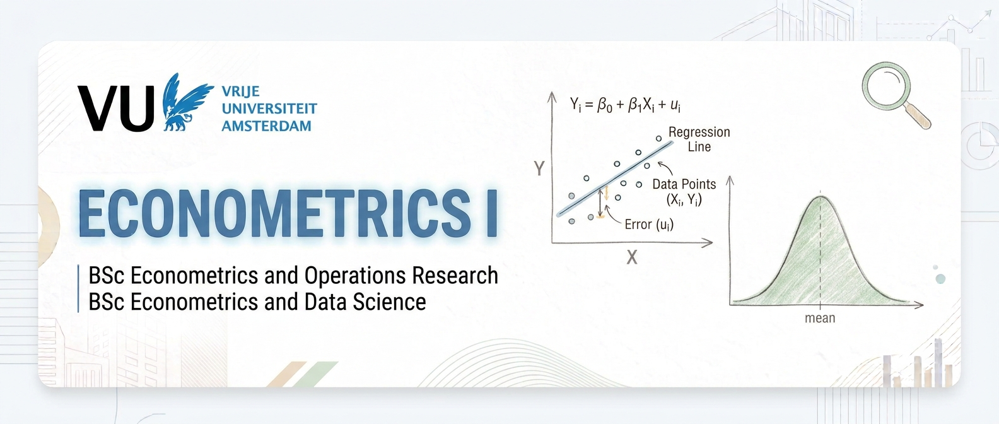

{width=100%}

# Preface

The course Econometrics I (E_EOR2_TR1) has been taught in a specific way for several years. During the first period, the simple linear regression model was discussed based on the book "Introduction to Econometrics" by James H. Stock and Mark W. Watson. The first chapters consider the basics of the regression model with only one independent variable, where the model is presented for a single cross-sectional unit. In the second period, the model got extended to include multiple regressors and similar topics were treated. However, the book "Introduction to the Theory of Econometrics" (ITE, henceforth) by Jan R. Magnus made use of vector and matrix notation to represent the model.

Whereas one could argue that it can be beneficial to see some topics repeated, the setup created a certain disconnection between the materials in both periods. This should ideally not be the case, as the notation should not play such a dominant role in understanding the linear regression model. On the contrary, the two different notations should be complementary and during the course we will see several examples for which it is more convenient to use one over the other. Generally, expressions are a bit more intuitive using unit-specific notation while formulas are more compact based on vector and matrix notation.

In the new setup, we study the linear regression model using both forms of notation simultaneously. We start with the multiple linear regression from the outset and treat the simple linear model as a specific case, because it enhances our general understanding. In the case of a single regressor, linear regression can be represented by a line and meaningful graphs can be computed. When there are more explanatory variables, it becomes much more difficult to express the model graphically. 

We follow the **Introduction to the Theory of Econometrics** book by Jan R. Magnus and this website provides all supporting material based on unit-specific notation. Thus, "Introduction to Econometrics" by James H. Stock and Mark W. Watson is no longer considered a *mandatory* reading, but definitely stays in the list of recommended readings. It provides a nice and comprehensible introduction to the topic of linear regression. Hence, for those that need more explanations and examples, or for those that just want to know more, the book can provide exactly that.

I hope you enjoy the course! The main goal is to provide you with a solid basis in one of the main workhorses of econometrics: the linear regression model. If you plan to take more econometrics courses in the future, I can promise you that this model will come back very often. Sometimes it needs to be adapted to properties of the data (e.g. censored/truncated/categorical data) or the type of data (e.g. time series or panel data) that you have at your disposal, but most models (even nonlinear ones!) are rooted in the linear regression model. Good luck studying and have fun!

Amsterdam, May 21, 2026

Sean Telg

# Frequently asked questions

## Should I still buy the book or is this website sufficient?
It is important that you still buy the book *Introduction to the Theory of Econometrics*, because it forms the basis of this course. This website provides supporting material and extra explanations. It can by no means be seen as a replacement of the book. 

# Acknowledgements

I would like to thank Ronald de Vlaming for helping me set up this website and Jan R. Magnus for the several talks about this course that led to writing an exercise book together.
