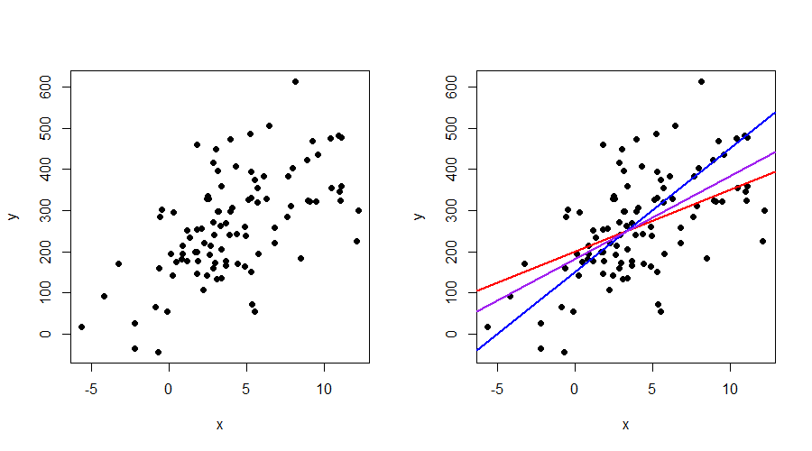

::: {.callout-tip icon="false"}
## 📚 This week's roadmap

- Least squares in the simple linear model
- Chapter 1

:::

## Contents
Note that *we consider a simplified setting first*. That is, we do not yet deal with random events and in fact, we answer the following (simple) question: given a collection of points, how can we draw the best line through them? Thus, we are dealing with a problem of *approximation* rather than *estimation*. Two methods that define distance differently are studied: least squares and least absolute deviations. To assess how well the line fits the points in the graph, we study measures of fit. Lastly, we study how the fit is affected whenever we add or omit variables.

## A simplified setting
Before we define the linear regression model in its typical form, we take a step back by assuming that **nothing is uncertain**. That is, we have $n$ points $(x_{i}, y_{i})$ but these should not be seen as outcomes of a random process. An example with $n=100$ points can be found in Figure 1(a). You should view the problem as someone drawing $n$ points on a piece of paper and then asking you: what is the best-fitting line through all these points? This is a problem of **approximation** instead of estimation. The difference might not be clear to you just yet, but throughout discussing Chapter 1 and 2 of ITE you should get an intuition why this distinction matters.

{width=100%}

From looking at Figure 1a, we can imagine that if a so-called "best-fitting line" exists, that it is probably upward-sloping as higher values of $x$ are typically also accompanied with higher values of $y$. But how should the "best-fitting line" look like? Figure 1b shows three plausible candidates depicted in blue, red and purple. They reveal that it is complicated to determine a "best-fitting line" with the naked eye. In order to find such a line, we have to model the problem mathematically and define an objective function specifying what "best fit" actually means.   

## Mathematical representation
If all points were located on a line, we could represent every point by $y= a + bx$, where $a$ denotes the intercept and $b$ the slope. However, since the points are scattered around, we need something extra. That is, we can define every point $(x_{i},y_{i})$ as 
$$
y_{i} = \beta_1 + \beta_2 x_{i} + u_{i}, \qquad (i = 1, \ldots, n), 
$$ {#eq-linreg}
where the $u_{i}$ are vertical deviations from the line and $n$ denotes the number of observations. The only reason that we replaced our $a$ and $b$ by $\beta_{1}$ and $\beta_{2}$ is because we need more $\beta$s when we generalize the problem. In other words, it is just a notational convenience as you will find out soon.

Now that we have modelled every point $(x_{i},y_{i})$ for $i = 1,\ldots, n$, we have to think about what properties the best-fitting line should have. Intuitively, the line should probably lie close to the points. It is impossible to lie near  all the points, but overall, it should probably go somewhat "through the middle of the cloud of dots". We need to formalize this notion mathematically:

::: {.callout-note title="Distance"}
Choose $\beta_{1}$ and $\beta_{2}$ in such a way that the distance from the line to the observations is as small as possible (or equivalently, make the deviations as small as possible).
:::

The previous quote is still not formal enough, because we need to define distance. If we were to add up all the $u_{i}$ values, we would also include negative values in our distance measure, which does not seem right. There are various ways to define distance, but we consider the following function
$$
\phi(\beta_{1},\beta_{2}) = \sum_{i=1}^{n} u_{i}^{2} = \sum_{i=1}^{n} (y_{i} - \beta_{1} - \beta_{2} x_{i})^{2},
$$ {#eq-ols}
and minimize this function with respect to $\beta_{1}$ and $\beta_{2}$.

We can see that our original problem can be formulated as an optimization problem. Because there is no randomness involved (remember: all points $(x,y)$ are simply fixed), we call the solution to the minimization problem **the least squares approximator** (so not estimator!).

::: {.callout-tip icon="false"}
## 📚 Read in ITE

What we did so far is very close to Section 1.1 and 1.2 of ITE, so you might want to have a look at those sections before we continue.

We are now going to derive the least squares approximator using results from calculus that you are familiar with (not included in the book). Afterwards, we continue in ITE where we use vector and matrix to derive the same result and generalize to more variables.  

:::

## Deriving the least-squares approximator
We can minimize the function $\phi(\beta_{1},\beta_{2})$ by taking partial derivatives of $\phi(\beta)$ with respect to $\beta_{1}$ and $\beta_{2}$, setting them equal to zero and solving the system of equations.

$$
\begin{aligned}
\frac{\partial \phi(\beta_1,\beta_2)}{\partial \beta_1}
&=
\sum_{i=1}^{n} \frac{\partial (y_i - \beta_1 - \beta_2 x_i )^{2}}{\partial \beta_1} \notag \\ 
&= 
\sum_{i=1}^{n} \frac{\partial ( y_i - \beta_1 - \beta_2 x_i )^{2}}{\partial (y_i - \beta_1 - \beta_2 x_i )} \;
\frac{\partial (y_i - \beta_1 - \beta_2 x_i )}{\partial \beta_1} \notag \\
& =  \sum_{i=1}^{n} 2 (y_i - \beta_1 - \beta_2 x_i) \times (-1) \notag \\
& =  -2 \sum_{i=1}^{n} (y_i - \beta_1 - \beta_2 x_i).
\end{aligned} 
$$ {#eq-foc1}
It is a good exercise to check that the second partial derivative is given by
$$
\frac{\partial \phi(\beta_1,\beta_2)}{\partial \beta_2} =  -2 \sum_{i=1}^{n} (x_{i}y_{i} - \beta_{1}x_{i} - \beta_{2}x_{i}^{2}).
$$ {#eq-foc2}
The optimal $\beta_{1}$ and $\beta_{2}$ are the values for which (@eq-foc1) and (@eq-foc2) are equal to zero. These are called the **first-order conditions**.

We continue by setting both equations equal to zero and multiplying them by $-\frac{1}{2n}$. In addition, we multiply (@eq-foc1) by $\overline{x}$ to obtain:
$$
\overline{x} \ \overline{y} - \beta_{1} \overline{x} - \beta_{2}\overline{x}^{2} = 0,
$$ {#eq-foc11}
$$
\overline{xy} - \beta_{1} \overline{x} - \beta_{2} \overline{x^2} = 0,
$$ {#eq-foc21}
where $\overline{x} = \frac{1}{n}\sum_{i=1}^{n} x_{i}$ and $\overline{y} = \frac{1}{n}\sum_{i=1}^{n} x_{i}$ represent the sample mean of $x$ and $y$, respectively, $\overline{xy} = \frac{1}{n} \sum_{i=1}^{n} x_{i}y_{i}$ is the sample mean of the variable $xy$ and $\overline{x^{2}} = \frac{1}{n} \sum_{i=1}^{n} x_{i}^{2}$ is the sample mean corresponding to the variable $x^{2}$.

::: {.callout-warning title="Be careful!"}

Note that generally $\overline{xy} = \frac{1}{n} \sum_{i=1}^{n} x_{i}y_{i} \neq \overline{x} \ \overline{y}$ and similarly, $\overline{x}^{2} \neq \overline{x^{2}}$.

Not convinced? Try out a simple numerical example and you will see it!

:::

Subtracting (@eq-foc11) from (@eq-foc21) results in
$$
[\overline{xy} - \overline{x} \ \overline{y}] - \beta_{2}[\overline{x^2} - \overline{x}^{2}] = 0, 
$$
from which we can find the least-squares approximator
$$
b_{2} = \frac{\overline{xy} - \overline{x} \ \overline{y}}{\overline{x^2} - \overline{x}^{2}} = \frac{\frac{1}{n} \sum_{i=1}^{n} x_{i}y_{i} - \overline{x} \ \overline{y}}{\frac{1}{n} \sum_{i=1}^{n} x_{i}^{2} - \overline{x}^{2}}. 
$$ {#eq-olsb}
Given $b_{2}$, we can easily find an expression for $b_{1}$, as setting (@eq-foc1) equal to zero, multiplying it by $-\frac{1}{2n}$ and evaluating it at the optimal solution yields the relation
$$
\overline{y} - b_{1} - b_{2}\overline{x} = 0 \implies b_{1} = \overline{y} - b_{2}\overline{x}. 
$$

::: {.callout-warning title="Least squares derivation"}

Any econometrician should know how to derive the least squares estimator in the simple linear model. The derivations on this page are kept short. It is a good exercise to do the derivations by yourself step-by-step.

:::

Whereas the expression for $b_{2}$ in (@eq-olsb) is of course perfectly valid, the estimator for the slope coefficient is often presented in the following way
$$
b_{2} = \frac{\sum_{i=1}^{n} (x_{i} - \overline{x})(y_{i} - \overline{y})}{\sum_{i=1}^{n} (x_{i} - \overline{x})^{2}} = \frac{s_{xy}}{s_{x}^{2}} = r_{xy} \frac{s_{y}}{s_{x}},
$$ {#eq-olsb2}
because it clearly shows that $b_{2}$ can be represented in terms of the sample covariance ($s_{xy}$) and sample correlation ($r_{xy}$) between $x$ and $y$ as well as the sample variance of $x$ ($s^{2}_{x}$) and sample variance of $y$ ($s^{2}_{y}$). Even though we are dealing with two equal expressions for $b_{2}$, it is important that you can show the result in two directions: i.e, going from (@eq-olsb) as starting point to (@eq-olsb2) and vice versa (from @eq-olsb2 to @eq-olsb). We leave these derivations as one of the exercises.

### Residuals and fitted values
Now that we have found the least-squares approximation, we can define some useful terms. Make sure that you do not mix them up. Previously, we defined the deviations $u_{i}$, which we can also present in the following way
$$
u_{i} = y_{i} - \beta_{1} - \beta_{2}x = y_{i} - (\beta_{1} + \beta_{2}x_{i}), \qquad (i = 1,\ldots, n).
$$
In other words, a deviation $u_{i}$ is the difference between the point $y_{i}$ and the line $\beta_{1} + \beta_{2}x$. Because the $\beta$s are unknown to us, this represents the true line. We can approximate this true line by replacing the $\beta_{1}$ and $\beta_{2}$ by the least-squares approximators that we just derived. This way, we get
$$
e_{i} = y_{i} - b_{1} - b_{2}x = y_{i} - (b_{1} + b_{2}x_{i}), \qquad (i = 1,\ldots, n),
$$
where $e_{i}$ is called a **residual**. The residual can thus be seen as "the part that remains" after approximating the line and subtracting it from $y_{i}$. Thus, *do not forget*: the deviation $u_{i}$ is formed based on the true parameters $\beta_{1}$ and $\beta_{2}$, while the residual is based on the approximated parameters $b_{1}$ and $b_{2}$. Even though this might only seem a subtle difference, it is crucial in understanding linear regression.

After defining residuals, we can revisit the first-order conditions that we obtained by setting (@eq-foc1) and (@eq-foc2) equal to zero. Since these two equations hold for any admissible combination of ($\beta_{1},\beta_{2}$), they also hold when evaluated at the optimal solution ($b_{1},b_{2}$). They lead to the following two conditions holding true:
$$
\text{F.O.C. 1: } \quad \sum_{i=1}^{n} e_{i} = 0, \qquad \text{F.O.C. 2: } \quad \sum_{i=1}^{n} e_{i}x_{i} = 0, 
$$
which means that the residuals are orthogonal to the intercept (F.O.C. 1) and to the regressor $x$ (F.O.C. 2). At this point, it is important to understand that least squares *imposes* these conditions.

Besides the residuals, we can also define **fitted values** or the **predictor** as
$$
\hat{y}_{i} = b_{1} + b_{2}x_{i}, \qquad (i = 1,\ldots, n),
$$
because for a given value of $x_{i}$, this is what the line 'predicts' the value of $y_{i}$ to be. The difference between $y_{i}$ and $\hat{y}_{i}$ is, as we saw before, the residual $e_{i}$.

### Generalizing these results
Deriving the least-squares approximator is rather straightforward when we have only one variable $x$, because the problem boils down to solving a system of two unknowns ($\beta_{1},\beta_{2}$). If we have $k$ parameters to estimate, then we would have to take $k$ partial derivates, set them equal to zero, and continue to solve the system of equations. We can circumvent this problem using vector and matrix calculus.

::: {.callout-tip icon="false"}
## 📚 Read in ITE

Read Section 1.3 - 1.7.

These sections focus on the same derivations that we have done so far, but then based on multiple variables. In short:

- Section 1.3 shows how to derive the least-squares approximation by writing (@eq-linreg) in matrix form. In fact, the found solution $b = (X'X)^{-1}X'y$ is shown not to depend on the number of variables contained in $X$. 
- Section 1.4 consists of an alternative derivation, but one needs to know the solution of the optimization problem in advance for this proof to work. 
- Section 1.5 defines residuals and discusses their main properties.
- Section 1.6 provides a geometric interpretation of least squares and the first-order conditions.
- Section 1.7 discusses an alternative method *Least Absolute Deviations* (LAD) to approximate the parameteres and makes the comparison with least squares.

:::

## The fit

We determined how to approximate the parameters in the model, but this does not tell us whether the approximation is 'good'. We are going to define two **measures of fit** to make such a judgement. But first, we will introduce three important quantities:
$$
\text{Total sum of squares: } \quad \text{SST} = \sum_{i=1}^{n} (y_{i} - \overline{y})^{2} = y'Ay, 
$$ {#eq-sst}
$$
\text{Sum of squared residuals: } \quad \text{SSR} = \sum_{i=1}^{n} e_{i}^{2} = e'e, 
$$ {#eq-ssr}
$$ 
\text{Explained sum of squared: } \quad \text{SSE} = \sum_{i=1}^{n} (\hat{y}_{i} - \overline{y})^{2} = \hat{y}'A\hat{y},
$$ {#eq-sse}
where (@eq-sst) represents the total variation in the dependent variable $y$, (@eq-ssr) the total unexplained variation in $y$ and (@eq-sse) the total variation in the predicted value $\hat{y}$. Note that all sums are build up in a similar way as a sample variance by considering the variable minus its sample mean. This is clearly seen in the definition of SST. The other two need some further inspection. As exercises, we will show that $\frac{1}{n}\sum_{i=1}^{n} e_{i} = 0$ generally and that $\overline{y} = \overline{\hat{y}}$. This explains why SSR and SSE are defined "differently".

Based on the definitions above, we can now introduce the **coefficient of determination** or often just called **R squared**:
$$
R^{2} = 1 - \frac{\text{SSR}}{\text{SST}}.
$$
Provided there is a constant term among the regressors, the value of $R^{2}$ lies in the interval $[0,1]$ and can therefore be interpreted as the percentage of variation in the dependent variable explained by the independent variables. Its popularity stems from this easy interpretation.

Another measure of fit that is often reported is the **standard error of the regression** (SER) and is defined as
$$
\text{SER } = \sqrt{\frac{\text{SSR}}{n-k}},
$$
where $k$ denotes the number of regressors (number of columns in $X$). It approximates the standard deviation of $u$ (denoted by $\sigma_{u}$) and can thus be compared to the sample standard deviation of $y$ (denoted by $s_{y}$). If the value of the SER is low compared to $s_{y}$ it indicates that the model explains a lot of the variation in the dependent variable $y$.

::: {.callout-tip icon="false"}
## 📚 Read in ITE

Read Section 1.8 and 1.9.

- Section 1.8 shows how to derive $R^{2}$ using SST, SSR, SSE and the matrix $A$ and the importance of the first-order conditions.
- Section 1.9 centers around the questions **How many variables should we include in the model? And which ones should we pick?**. This is important for model selection, a key issue in econometrics.

:::