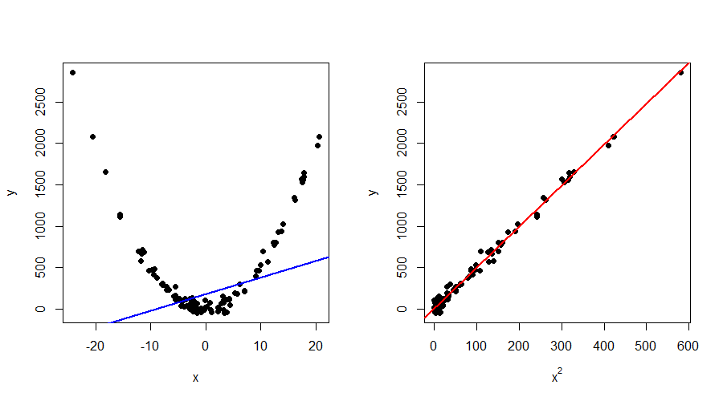

::: {.callout-tip icon="false"}
## 📚 This week's roadmap

- Chapter 2, Section 2.1 - 2.9.

:::

## Contents
This week, we are going to move from approximation to estimation. We no longer assume that the world is nonrandom, but instead suppose that the data at our disposal are realizations of random variables. You might have the feeling that not much is changing, but we will spend some extra time highlighting the difference when we get to best unbiased estimation. But before discussing that, we are going to define the linear regression model, the corresponding terminology and a set of ideal conditions (assumptions). Moreover, we consider the important difference between a data-generation process (DGP) and a model. Lastly, we make a start with best unbiased estimation, which boils down to solving a restricted optimization problem.

## The simple linear regression model
The simple linear regression model looks exactly the same as in the approximation framework
$$
y_{i} = \beta_{1} + \beta_{2}x_{i} + u_{i}, \qquad (i=1, \ldots, n),
$$
but its interpretation is quite different. In the previous setup, all observations $(x_{i}, y_{i})$ for $i = 1, \ldots, n$ were fixed. Thus, they could just be treated as given. The task was then simple: find the best-fitting line based on the criterion that the sum of squared distances from the line to the observations is as small as possible. However, we are now going to assume that $y_{i}$ is a random variable called the **dependent variable** (or **explained variable**, **regressand**). This variable is related to an **explanatory variable** $x_{i}$ (or **indepedent variable**, **regressor**). At first, we are going to assume that $x_{i}$ is nonrandom. The basics of econometric theory do not change if we make this simplifying assumption and the material is easier to grasp. We call $\beta_{1}$ and $\beta_{2}$ the unknown **parameters** or **coefficients** of the model, and $u_{i}$ the **error term** or **disturbance term**. 

Important to remember: $y_{i}$ and $u_{i}$ are random variables, $x_{i}$, $\beta_{1}$ and $\beta_{2}$ are nonrandom. The variables $y_{i}$ and $x_{i}$ are observable, while $\beta_{1}$, $\beta_{2}$ and $u_{i}$ are unobservable. The generalization to the **multiple linear regression model** can be found in ITE. We also study the ideal conditions (assumptions). 

::: {.callout-tip icon="false"}
## 📚 Read in ITE

Read Section 2.1 - 2.4.

- Section 2.2 contains an introductory text about randomness.
- Section 2.3 explains the difference between a theoretical and a realized observation.
- Section 2.4 introduces the set of ideal conditions for the linear model.

Afterwards, we continue here to discuss the role of assumptions and how to interpret them.

:::

## The role of assumptions
The assumptions introduced in ITE for the general model
$$
y = X\beta + u,
$$
are given by

- **Assumption 1**: The model is linear.
- **Assumption 2**: The $n \times k$ matrix $X$ is nonrandom and has rank $k$.
- **Assumption 3**: The $n \times 1$ vector $u$ has mean zero and variance $\sigma^{2}I_{n}$.
- **Assumption 4**: The $n \times 1$ vector $u$ follows a multivariate normal distribution.
- **Assumption 5**: If we let $Q_{n} = X'X/n$, then $Q_{n} \to Q$ as $n \to \infty$, where $Q$ is a finite and positive definite $k \times k$ matrix.

These assumptions are quite different in nature and it is good to understand why we need them. It can be argued that assumptions are important for two main reasons, which we can classify as **theoretical** and **diagnostic** reasons. In the first case, we need the set of ideal conditions to show certain theoretical results such as unbiasedness, consistency and asymptotic normality of estimators. However, in real life, assumptions might not hold true. A slight deviation could not be extremely problematic, but what if we are actually far off from the ideal conditions? This brings us to the second case, the diagnostic reason. During this course, you will learn how to check and test the assumptions. Moreover, you learn how to study the effects of violations on estimators and test statistics in a controlled environment. This way, you can judge the appropriateness of your model (and make adjustments, if needed). Let us consider the assumptions separately.

### Assumption 1: The model is linear
It is important to note that the linearity is in terms of the *parameters* $\beta$, not the variables $X$. Interestingly, this means that *nonlinear relationships between variables can be modelled using a linear regression model*. Let's consider a famous example in which there is a quadratic relationship between $x$ and $y$. Figure 1 displays this example. 

{width=100%}

Figure 1a shows that linear regression between $x$ and $y$ is not meaningful. The blue line represents the estimated linear regression line, which is clearly not able to capture the relationship. However, if we instead run the regression
$$
y_{i} = \beta_{1} + \beta_{2} x^{2}_{i} + u_{i},
$$
we see that this relationship is close to linear. Consequently, the estimated linear regression line (in red) now shows an almost perfect fit. Of course, it is not always possible to recast in a nonlinear relationship into a linear regression model (where the variables are transformed). There are "linear models in disguise", but sometimes there is need for a nonlinear regression model (not captured in this course). Because linearity is a so-called first-order approximation to the model, it often even forms the basis for nonlinear models (you will see some examples of such models [logit/probit/tobit] in Econometrics II). Main advantage of the linear regression model is its high degree of interpretability.

::: {.callout-important title="Exercise: Can we use linear regression?" collapse = true}

Determine whether linear regression is warrented for the following models:

a. $y_{i} = \beta_{1}x_{1,i} + \sqrt{\beta_{2}}x_{2,i} + u_{i}$
b. $y_{i} = \beta_{1}x_{1,i} + \beta_{2} x_{1,i}^{2} + u_{i}$
c. $y_{i} = \beta_{1}x_{1,i} + \beta_{2}x_{2,i} + \beta_{3}x_{1,i}x_{2,i} + u_{i}$
d. $y_{i} = \beta_{1} \exp(\beta_{2}x_{1,i})u_{i}$ for $\beta_{1} > 0$, $u_{i} >0$, $y_{i} > 0$ for all $i$.

:::

### Assumption 2: The $n \times k$ matrix $X$ is nonrandom and has rank $k$
This assumption has two parts to it, which we will discuss separately. First, the matrix $X$ is nonrandom. Note that this is a choice that we make for theoretical reasons, because our mathematical derivations are easier if we treat the independent variables as given. This is not something that you can check or test on data. We make this simplifying assumption to make our life easier (we circumvent conditioning, which we discuss in week 6 of the course) but it comes at the cost of a loss in generality.

::: {.callout-note title="Relation between $n$ and $k$" collapse = true}
It is also implicit that the number of observations $n$ is always larger than the number of regressors $k$. If this was not the case, we would not be able to estimate the coefficients in the model. You can draw the analogy with solving a system of equations. If the pieces of information $n$ are smaller than the number of unknowns $k$, then the system cannot be solved. In case of equality $n=k$, it is technically possible to find a solution but it is very undesirable in the estimation framework (some measures, such as the SER, could not even be computed) as there are no degrees of freedom left to test or validate the model's accuracy. 
:::

Second, we assume that the $n \times k$ matrix $X$ has rank $k$. 
The assumption dictates that all $k$ columns are linearly independent. In other words, it is impossible to write a single column as a linear combination of all the other columns. Why is this important? Last week, we saw that the least-squares approximator is given by $b = (X'X)^{-1}X'y$. In the estimation framework, this formula remains the same as we will prove next week. Note that $X'X$ is a $k \times k$ matrix of full rank $k$ (see Section A.3 in ITE for more details). We can only compute the inverse of $X'X$ if it is nonsingular, i.e., if it has full rank.

In case we do have columns in $X$ that are linear combinations of each other, we call it **perfect multicollinearity**. The wording is exactly saying what is going on: multiple columns are perfectly collinear. Below you can again find a short exercise in which you have to guess whether $X$ could be collinear.

::: {.callout-important title="Exercise: Perfect multicollinearity or not?" collapse = true}

For the following models, argue whether it is possible that $X$ is collinear.

a. $y_{i} = \beta_{1} + \beta_{2}x_{i} + u_{i}$.
b. $y_{i} = \beta_{1} + \beta_{2}\text{North}_{i} + \beta_{3}\text{South}_{i} + \beta_{4} \text{West}_{i} + \beta_{5}\text{East}_{i} + u_{i}$, where $y_{i}$ is the wealth in city $i$ and $\text{North}_{i} = 1$ if the city is located in the North, and vice versa for the other regressors. Each city can only belong to one cardinal direction.
c. $y_{i} = \beta_{1} + \beta_{2}\text{Full-Time}_{i} + \beta_{3}\text{Part-Time}_{i} + u_{i}$, where $y_{i}$ is productivity of employee $i$ who is either a full-time or part-time worker.
d. $y_{i} = \beta_{1} + \beta_{2}x_{i} + \beta_{3} x_{i}^{2} + u_{i}$.

:::

### Assumption 3: The $n \times 1$ vector $u$ has mean zero and variance $\sigma^{2}I_{n}$

The first part of the assumption, $E(u) = 0$, is not really restrictive. Even if the errors had a non-zero population mean, its effect would be absorbed into the model's intercept. Thus, it is convenient to assume without loss of generality. The second part of the assumption, $\Var(u) = \sigma^{2}I_{n}$ tells us a couple of things. Note that the variance of a vector is a matrix with the separate variances on the diagonal, and the covariances on the off-diagonal elements. That is,
$$
\Var(u) = 
\begin{pmatrix}
\Var(u_{1}) & \Cov(u_{1},u_{2}) & \cdots & \Cov(u_{1}, u_{n}) \\
\Cov(u_{2}, u_{1}) & \Var(u_{2}) & \cdots & \Cov(u_{2}, u_{n}) \\
\vdots & \vdots &  & \vdots \\
\Cov(u_{n}, u_{1}) & \Cov(u_{n}, u_{2}) & \cdots & \Var(u_{n})
\end{pmatrix} =
\begin{pmatrix}
\sigma^{2} & 0 & \cdots & 0 \\
0 & \sigma^{2} & \cdots & 0 \\
\vdots & \vdots & & \vdots \\
0 & 0 & \cdots & \sigma^{2}
\end{pmatrix}.
$$
Thus, we can see that $\Cov(u_{i}, u_{j}) = 0$ for all $i \neq j$. In words, this means that the error terms of respondents $i$ and $j$ are not correlated. Ideally, we also do not want a relation between two or more respondents. This can be motivated from both a theoretical and practical perspective. If the data is **independent and identically distributed (i.i.d.)**, then this reflects that the respondents come from the same population (they have an identical distribution) but their responses are made independently of one another. 

Another important feature is that $\Var(u_{i}) = \sigma^{2}$ for all $i = 1, \ldots, n$. This is a property called **homoskedasticity**. In empirical work, this assumption might fail and that is why we will revisit it towards the end of the course. For now, we assume that there is a constant variance for all the error terms.
