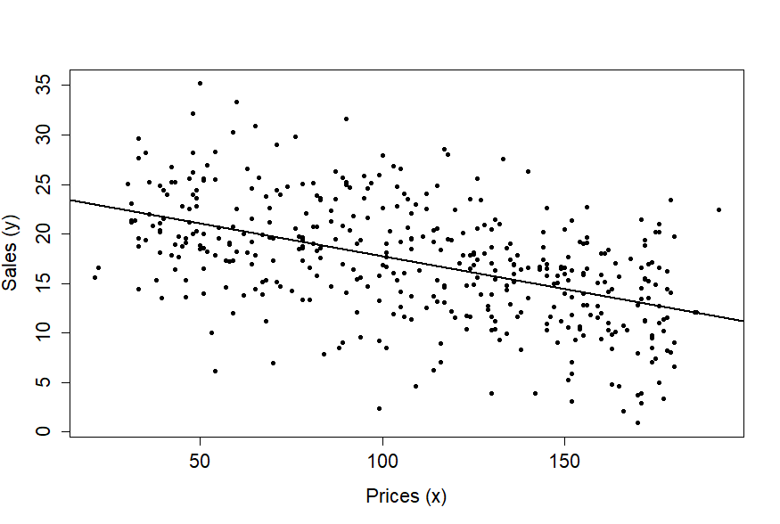

::: {.callout-tip icon="false"}
## 📚 This week's roadmap

- Chapter 6.

:::

## This week's contents
So far, we covered Chapter 1 to 3 in ITE. We derived the estimators $\widehat{\beta} = (X'X)^{-1}X'y$, $s^{2} = e'e/(n-k)$ under the condition
that they are unbiased. We continued by deriving test statistics for single and multiple linear restrictions. These results were found based on
the classical assumptions for the linear regression model, except for one. The assumption that $X$ is nonrandom has been motivated in Section 2.7 using the argument that the basics of econometric theory do not change if we make this simplifying assumption. Whereas this is true, any good econometrician needs to know how to deal with **conditioning**, which is the title of this week's Chapter 6. Since you are already familiar with this topic from your previous probability theory and statistics course, we will focus almost exclusively on the linear regression model. We revisit some of the previously found results and see how their derivation changes when $X$ is assumed random.

::: {.callout-tip icon="false"}
## 📚 Read in ITE

- Section 6.1 - 6.4. These sections intuitively explain the concept of conditioning and help you refresh your memory on the concept.
- Section 6.5. This section introduces two very important concepts: the **law of total expectation** (also called the *law of iterated expectations* or the *tower property*) and the **law of total variance**.

:::

## The simple linear regression model
Consider the simple linear regression model
$$
y_{i} = \beta_{1} + \beta_{2}x_{i} + u_{i}, \qquad (i = 1,\ldots, n),
$$
where $x_{i}$ is assumed to be random. This means that $u_{i}$ is no longer the only random part on the right-hand side of this equation and thus we need to make an assumption about the relationship between $u_{i}$ and $x_{i}$. 

An often chosen assumption is **mean-independence**, which can be expressed as $E(u_{i}|x_{i}) = 0$, because it is stronger than uncorrelatedness between $u_{i}$ and $x_{i}$ and weaker than independence (which is deemed unrealistic). This condition is also called **strict exogeneity**. In addition, **variance-independence** is imposed, which shows that the variance of $u_{i}$ does not depend on $x_{i}$, i.e. $\Var(u_{i}|x_{i}) = \sigma^{2}$. This is called **homoskedasticity** and we study its implications in more detail in the second part of this course.

These assumptions give a clear interpretation to the linear regression. Note that
$$
\begin{aligned}
E(y_{i}|x_{i}) &= E(\beta_{1} + \beta_{2}x_{i} + u_{i} | x_{i}) \\
               &= \beta_{1} + \beta_{2}E(x_{i}|x_{i}) + E(u_{i} | x_{i}) \\
               &= \beta_{1} + \beta_{2}x_{i},
\end{aligned}
$$
because $E(u_{i}|x_{i}) = 0$ by strict exogeneity. Thus, the **population linear regression line** simply represents the conditional mean of $y_{i}$ given $x_{i}$. This also reveals how to proceed in terms of prediction. In that case, we need the **sample linear regression line** which then represents an estimate of the conditional mean of $y_{i}$ given $x_{i}$.

We may also compute the conditional variance of $y_{i}$ given $x_{i}$. Note that
$$
\Var(y_{i} | x_{i}) = \Var(\beta_{1} + \beta_{2}x_{i} + u_{i} | x_{i}) = \Var(u_{i}|x_{i}) = \sigma^{2},
$$
since the systemic part $\beta_{1} + \beta_{2}x_{i}$ is fixed conditional on $x_{i}$. The difference with the unconditional variance of $y_{i}$ is important to notice. Using the law of total variance:
$$
\begin{aligned}
E(y_{i}) &= E(\Var(y_{i}|x_{i})) + \Var(E(y_{i}|x_{i})) \\
         &= E(\sigma^{2}) + \Var(\beta_{1} + \beta_{2}x_{i}) \\
         &= \sigma^{2} + \beta_{2}^{2}\Var(x_{i}) \\
         &= \sigma^{2} + \beta_{2}^{2}\sigma^{2}_{x}, 
\end{aligned}
$$
which has the nice interpretation that the total variation in $y_{i}$ is the sum of variation explained by $x_{i}$ and the unexplained variation from $u_{i}$. So, even though the variance of $y_{i}$ conditional on $x_{i}$ is always $\sigma^{2}$, the unconditional variance also contains variation arising because $x_{i}$ itself varies across observations.

### Unbiasedness of the least-squares estimator
Because $x_{i}$ is now **random**, the least-squares estimators $\widehat{\beta}_{1}$, $\widehat{\beta}_{2}$ and $s^{2} = \frac{1}{n-2}\sum_{i=1}^{n} \widehat{u}_{i}^{2}$ are now highly nonlinear functions of $(y, X)$. Under the conditions that we just imposed, we can still show unbiasedness of these estimators. Let's focus on $\widehat{\beta}_{2}$.

Under correct specification, i.e. the model and DGP coincide,note that we can write
$$
\widehat{\beta}_{2} = \beta_{2} + \frac{\sum_{i=1}^{n} (x_{i} - \overline{x})u_{i}}{\sum_{i=1}^{n} (x_{i} - \overline{x})^{2}},
$$
which we already showed in Week 2.

::: {.callout-note title="Reminder" collapse = "true"}
Note that
$$
\begin{aligned}
\widehat{\beta}_{1\2} &= \frac{\sum_{i=1}^{n} (x_{i} - \overline{x})(y_{i} - \overline{y})}{\sum_{i=1}^{n} (x_{i} - \overline{x})^{2}} \\
&= \frac{\sum_{i=1}^{n} (x_{i} - \overline{x})(\beta_{1} + \beta_{2}x_{i} + u_{i} - (\beta_{1} + \beta_{2}\overline{x} + \overline{u}))}{\sum_{i=1}^{n} (x_{i} - \overline{x})^{2}} \\
&= \frac{\sum_{i=1}^{n} (x_{i} - \overline{x})(\beta_{2}(x_{i} - \overline{x}) + (u_{i} - \overline{u}))}{\sum_{i=1}^{n} (x_{i} - \overline{x})^{2}} \\
&= \beta_{2} + \frac{\sum_{i=1}^{n} (x_{i} - \overline{x})(u_{i} - \overline{u})}{\sum_{i=1}^{n} (x_{i} - \overline{x})^{2}} \\
&= \beta_{2} + \frac{\sum_{i=1}^{n} (x_{i} - \overline{x})u_{i}}{\sum_{i=1}^{n} (x_{i} - \overline{x})^{2}}.
\end{aligned}
$$
Note that we plugged in the DGP at the second equality, the third and fourth equalities are rearranging terms, and the last equality follows from $\overline{u}\sum_{i=1}^{n}(x_{i} - \overline{x}) = 0$.

:::

Taking expectations now yields
$$
\begin{aligned}
E(\widehat{\beta}_{2}) &= E\left[ \beta_{2} + \frac{\sum_{i=1}^{n}(x_{i} - \overline{x})u_{i}}{\sum_{i=1}^{n} (x_{i} - \overline{x})^{2}} \right] \\
&= E(\beta_{2}) + E \left[ \frac{\sum_{i=1}^{n}(x_{i} - \overline{x})u_{i}}{\sum_{i=1}^{n} (x_{i} - \overline{x})^{2}}  \right] \\
&= \beta_{2} + E \left[ \frac{\sum_{i=1}^{n}(x_{i} - \overline{x})u_{i}}{\sum_{i=1}^{n} (x_{i} - \overline{x})^{2}}  \right].
\end{aligned}
$$
To obtain the desired result $E(\widehat{\beta}_{2}) = \beta_{2}$, we need to show that this second term equals zero. We are going to use the *law of total expectations*, because the term involves several random variables. If we define $X = (x_{1}, \ldots, x_{n})$, we can proceed as follows:
$$
\begin{aligned}
E \left( \frac{\sum_{i=1}^{n}(x_{i} - \overline{x})u_{i}}{\sum_{i=1}^{n} (x_{i} - \overline{x})^{2}}  \right) &=
E_{X} \left( \frac{\sum_{i=1}^{n}(x_{i} - \overline{x})E_{u_{i}|X}(u_{i}| X)}{\sum_{i=1}^{n} (x_{i} - \overline{x})^{2}}  \right) \\
&= E_{X} \left( \frac{\sum_{i=1}^{n}(x_{i} - \overline{x}) \cdot 0}{\sum_{i=1}^{n} (x_{i} - \overline{x})^{2}}  \right)
= 0,
\end{aligned} 
$$
where some subtle steps need extra explanation:

- The first equality makes use of the law of total expectations. We have to condition on $X = (x_{1}, \ldots, x_{n})$ and not just a single $x_{i}$, otherwise we may not take $\sum_{i=1}^{n} (x_{i} - \overline{x})$ outside of the inner expectation.
- The inner expectation is taken with respect to the conditional distribution $u_{i} | x_{1}, \ldots, x_{n}$, while the outer expectation is with respect to $x_{1}, \ldots, x_{n}$. To emphasize with respect to what distribution we take the expectation, we included them as subscripts. *You may do this as well, but note that it is not mandatory.*
- By combining $\Cov(u_{i}, u_{j}) = 0$ for all $i \neq j$ and normality, we have independence of all pairs of observations $(x_{i}, y_{i})$ and $(x_{j}, y_{j})$ for all $i \neq j$. Therefore, we can conclude $E_{u_{i}|X}(u_{i} | X) = E_{u_{i}|X}(u_{i} | x_{1}, \ldots, x_{n}) = E_{u_{i}|x_{i}}(u_{i} | x_{i}) = 0$. 

We have now calculated the unconditional expectation of $\widehat{\beta}_{2}$, which shows that the estimator is indeed unbiased. For completeness, we can also compute its variance. Let us first compute the conditional variance:
$$
\begin{aligned}
\Var(\widehat{\beta}_{2} | X) &= \Var\left( \beta_{2} + \frac{\sum_{i=1}^{n}(x_{i} - \overline{x})u_{i}}{\sum_{i=1}^{n} (x_{i} - \overline{x})^{2}} \Bigg| X \right) \\
&= \frac{1}{[\sum_{i=1}^{n} (x_{i} - \overline{x})^{2}]^{2}} \Var\left(\sum_{i=1}^{n}(x_{i} - \overline{x})u_{i} | X \right) \\
&= \frac{\sum_{i=1}^{n}(x_{i} - \overline{x})^{2}}{[\sum_{i=1}^{n} (x_{i} - \overline{x})^{2}]^{2}} \Var(u_{i} | X ) \\
&= \frac{\sigma^{2}}{\sum_{i=1}^{n} (x_{i} - \overline{x})^{2}}.
\end{aligned}
$$
We are now ready to compute the unconditional variance using the law of total variance.:
$$
\begin{aligned}
\Var(\widehat{\beta}_{2}) &= E(\Var(\widehat{\beta}_{2} | X)) + \Var(E(\widehat{\beta}_{2}|X)) \\
&= E\left( \frac{\sigma^{2}}{\sum_{i=1}^{n} (x_{i} - \overline{x})^{2}} \right) + \Var(\beta_{2}) \\
&= \sigma^{2} E\left(\frac{1}{\sum_{i=1}^{n} (x_{i} - \overline{x})^{2}} \right).
\end{aligned}
$$

::: {.callout-tip icon="false"}
## 📚 Read in ITE

You are now ready to read how this generalizes to the multiple linear regression model.

- Section 6.6 - 6.8.

:::

## Empirical applications
The past weeks' main focus has been on the theory behind the multiple linear regression model. We have looked at the ideal conditions, derived estimators and their corresponding standard errors as well as confidence intervals, prediction (intervals) and studied how to perform tests for single and multiple linear restrictions on the vector $\beta$. We have even touched upon the topics model selection and model averaging.

This puts us in a position to apply the model to real data and to correctly interpret its results. Running these analyses yourself will be addressed in the second part of the course, but let us consider two empirical applications from the book *Mastering Econometrics*.

::: {.callout-note title="The relationship between price and sales" collapse = "true"}

A shop specializing in shoes has sold $n = 420$ pairs of shoes in one week. The shop sells shoes in many price categories, and for each sale we know the price. The shopkeeper wants to understand the relationship between price ($x$) and sales ($y$).
Estimating the linear regression model
$$
y_{i} = \beta_{1} + \beta_{2} x_{i} + u_{i}
\qquad
(i=1,\dots,n),
$$
she obtains the following results:

| Coefficient | Estimate | Std. error | $t$-value |
|:------------|---------:|-----------:|----------:|
| Intercept   | $24.394$ | $0.664$    | $36.730$  |
| Price       | $-0.066$ | $0.006$    | $-11.750$ |

: Regression results {#tbl-regression}

graphically represented as
{width=100%}

a. Discuss the relationship between the variables in light of the estimation result. Is the relationship as expected?
b. Obtain a $95\%$ confidence interval for $\beta_{2}$.
c. Obtain a prediction for the number of sales given a price of 80. And also for a price of 300. Are these predictions reliable?
d. Describe a limitation of the linear model in describing the relationship. Is the linear model useful for this data set?

We could answer these questions as follows:

a. The regression line suggests a negative relationship between price and sales. There are about 21 sales at a price of 50 euros, about 18 at a price of 100 euros, and about 15 at a price of 150 euros.
Formally, a unit increase in price leads to a decrease of about 0.066 in sales. The relationship is statistically significant at the conventional $5\%$ and $1\%$ significance levels $\alpha$, which can be verified by comparing the $t$-statistic with the $(\alpha/2)$-quantiles (for two-sided tests) of the Student $t$-distribution with 418 degrees of freedom. In practice, we use the normal approximation when the degrees of freedom exceeds $30$. Since we know that $\Pr(|z|<1.96)=0.95$ and $\Pr(|z|<2.57)=0.99$ when $z \sim N(0,1)$, and both $36.730$ and $11.750$ are well above 1.96 and 2.57, the two estimates are significant.

b. The $95\%$ confidence interval is given by
$$
(\hat\beta_{2} - 1.96\sqrt{s^{2}v_{22}},\; \hat\beta_{2} + 1.96\sqrt{s^{2}v_{22}})
= (-0.078, -0.054),
$$
where the standard error $\sqrt{s^{2}v_{22}}$ equals $0.006$.
Thus, $\beta_{2} = 0$ is not included in the $95\%$ confidence interval, in agreement with the significance of the estimate discussed under (a).

c. For a price $x_{*} = 80$, the prediction is $\hat{y}_{*} = \hat{\beta}_{1} + \hat{\beta}_{2} \times 80 = 19.114$, and for $x_{*} = 300$, the prediction is $19.114$. The second prediction is less reliable because we have only a few observations for such large prices.

d. One of the limitations of a linear approximation is that it may not be a good approximation when we move away from the center.
For example, sales cannot be negative, and a linear model would lead to negative sales whenever the price is (very) large.
This does not mean that the model is useless, but it only provides a useful approximation for prices between, say, 30 and 200.

:::

The previous empirical application makes use of the simple linear regression model, which is very popular due to its straightforward interpretation and ability to clearly visualize the results. However, a regression model with only one independent variable is often insufficient to capture the essence of the problem. If we regress sales on price, then we explicitly allow sales to only depend on that single factor. It is very likely that sales are also explained by other factors than price, such as the type of shoes, the material of the shoes, the friendliness of the salesperson, et cetera. These variables are currently absorbed in the error term, and they may be correlated with price. Because of this, we may systematically over- or underestimate $\beta_{2}$. This argument is made clearly in Section 3.8 of ITE: we might include other regressors (auxiliary variables) simply to get a reliable estimate of the coefficient related to our focus variable (i.e., price in this case). We now consider an empirical application making use of the multiple linear regression model.

::: {.callout-note title="Returns to scale in electricity supply" collapse = "true"}

(If you want to run the analysis yourself, you can download the data set ME-data-3-01.xlsx from [my website](https://sites.google.com/view/seantelg/mastering-econometrics). These are real data that are obtained from *Nerlove, M. (1963), Returns to scale in electricity supply, Ch. 7 in: Christ, C. et al. (Eds.), Measurement in Economics, Stanford University Press, pp.\ 167--198.*).

The file contains data on 145 electric utility companies in 1955. There are five columns corresponding to
total costs in millions of dollars (TC), output in billions of kilowatt hours ($Q$), price of labor ($p_L$),
price of capital ($p_K$) and price of fuels ($p_F$). Estimate model $y = X\beta + u$, where $y = \log \text{TC}$ and
$$
X = \left(\imath : \log Q : \log p_L : \log p_K : \log p_F\right).
$$

a. Report the parameter estimates and standard errors.
b. Perform a $t$-test on all coefficients to verify which ones are significantly different from zero at the $5\%$ significance level.
c. Test and interpret the hypothesis $\beta_{2} = \beta_{3} = \beta_{4} = \beta_5 =0$.
d. Test and interpret the hypothesis $\beta_{2} = \beta_{4} = 0$.

(The file ME-code-3-04.R, available on the same website page mentioned above, can be used for the analysis.)

a. We obtain the following estimation results:

| Coefficient | Estimate | Std. error | $t$-value |
|:------------|---------:|-----------:|----------:|
| Intercept   | $-3.527$ | $1.774$    | $-1.987$  |
| $\log Q$    | $0.720$  | $0.017$    | $41.244$  |
| $\log p_L$  | $0.436$  | $0.291$    | $1.499$   |
| $\log p_F$  | $0.427$  | $0.100$    | $4.249$   |
| $\log p_K$  | $-0.220$ | $0.339$    | $-0.648$  |

: Estimated regression results {#tbl-regression}

b. The column $t$-value gives the desired information. If we test two-sidedly and use the normal approximation, then we simply ask whether the absolute $t$-values are larger or smaller than 1.96. This is the case for $\log Q$ and $\log p_F$, and also (but marginally) for the constant term. Hence, the coefficients of $\log Q$ and $\log p_F$ are significantly different from zero, the intercept is marginally significant, and the coefficients of $\log p_L$ and $\log p_K$ are not significantly different from zero.

c. The null hypothesis states that all coefficients, except for the intercept, are equal to zero. This test is sometimes called the *test of overall significance*, and it tests whether the *intercept-only model* fits the data as well as our proposed regression model.
In our case, the value of the $F$-statistic is 14.585, which is higher than the critical value of the $F(4,140)$-distribution, which is 2.436. Thus, we reject the null hypothesis. Our set of four regressors thus has some bearing on the explanation of total cost.

d. We now test whether the coefficients of $\log Q$ and $\log p_F$ are jointly equal to zero. This test is sometimes called the *partial $F$-test*. The value of the $F$-statistic is now 14.585, which is larger than 3.061, the critical value of the $F(2,140)$-distribution.
Thus, we reject the null hypothesis. Keeping these two regressors in the model is therefore a good idea.

:::

These two empirical applications only highlight how we can use the results that we derived over the past weeks. We will consider different applications in more detail during the second part of the course. We then develop misspecification tests, such that we cannot just estimate models and assess their fit, but also test whether they fulfill the assumptions (ideal conditions.)